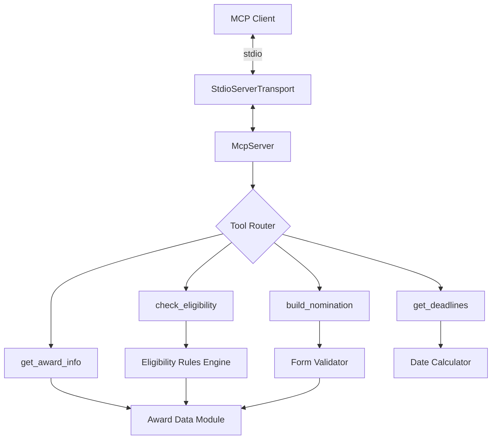

# Design Document: Good Service Awards MCP Server

## Overview

This design describes an MCP (Model Context Protocol) server that assists Scouts volunteers with Good Service Award nominations. The server exposes four tools over stdio transport:

1. **check_eligibility** — evaluates whether a nominee meets criteria for a specific award (or determines which awards they qualify for)
2. **build_nomination** — guides users through creating a complete nomination form with all required fields
3. **get_award_info** — returns award hierarchy details and individual award requirements
4. **get_deadlines** — returns quarterly submission deadlines and processing timelines

The server is a standalone TypeScript package distributed via npm, runnable with `npx`. All award rules and data are statically embedded — no network access or API keys required.

### Key Design Decisions

- **TypeScript + `@modelcontextprotocol/sdk` (v1.x)**: The official MCP TypeScript SDK is the most mature option for building stdio-based MCP servers distributable via npx. v1.x is the current stable release recommended for production.
- **Zod for input validation**: The MCP SDK uses Zod schemas for tool parameter definitions, providing both runtime validation and automatic schema generation for MCP clients.
- **Static data module**: All award hierarchy data, eligibility rules, and deadline information are encoded as TypeScript constants. This keeps the server self-contained with zero external dependencies beyond the SDK.
- **Pure function core**: Eligibility checking and validation logic are implemented as pure functions separate from the MCP transport layer, making them independently testable.

## Architecture



The architecture follows a layered approach:

1. **Transport Layer** — `StdioServerTransport` from the MCP SDK handles stdin/stdout communication
2. **Server Layer** — `McpServer` manages tool registration and request routing
3. **Tool Handlers** — thin functions that parse inputs, call domain logic, and format responses
4. **Domain Logic** — pure functions implementing eligibility rules, form validation, and date calculations
5. **Data Layer** — static TypeScript modules containing award hierarchy, criteria, and deadline constants

## Components and Interfaces

### Entry Point (`src/index.ts`)

```typescript
#!/usr/bin/env node
import { McpServer } from "@modelcontextprotocol/sdk/server/mcp.js";
import { StdioServerTransport } from "@modelcontextprotocol/sdk/server/stdio.js";
// Tool registrations...
```

The entry point creates the server, registers all tools with their schemas, and connects via stdio.

### Tool: `check_eligibility`

**Purpose**: Evaluates nominee eligibility against award criteria.

**Input Schema**:
```typescript
{
  serviceYears: z.number().int().positive(),
  isMember: z.boolean(),
  isAppointed: z.boolean(),
  mandatoryLearningComplete: z.boolean(),
  criminalRecordCheckValid: z.boolean(),
  previousAward: z.enum([...awardNames, "none"]).optional(),
  dateOfLastAward: z.string().date().optional(),
  targetAward: z.enum(awardNames).optional(),
}
```

**Output**: JSON object with `eligible: boolean`, `eligibleAwards: string[]` (when no target specified), and `unmetCriteria: { criterion: string, reason: string }[]`.

### Tool: `build_nomination`

**Purpose**: Accepts nomination form field data, validates it, and returns the complete form or status of remaining fields.

**Input Schema**:
```typescript
{
  action: z.enum(["submit_field", "get_status", "get_form"]),
  field: z.enum([...fieldNames]).optional(),
  value: z.string().optional(),
}
```

**Output**: Depends on action — field acceptance confirmation with remaining fields, validation errors, or the complete formatted nomination form.

Note: Since MCP tools are stateless per-invocation, the nomination builder operates by accepting all fields in a single call or by the MCP client managing state across multiple calls. The tool validates individual fields and produces the final form when all fields are provided.

**Revised approach — single-call form builder**:

```typescript
{
  mainRole: z.string().min(1),
  additionalService: z.string().min(1),
  keyAchievements: z.string().min(1),
  achievementsPeriod: z.enum(["since_last_award", "entire_service"]),
  levelOfService: z.string().min(1),
  serviceLevelChange: z.enum(["similar", "substantially_increased"]),
  communityInvolvement: z.string().min(1),
  otherInformation: z.string().min(1),
  citation: z.string().min(1).max(300),
}
```

**Output**: The complete formatted nomination form text, or validation errors identifying which fields failed and why.

### Tool: `get_award_info`

**Purpose**: Returns award hierarchy or details about a specific award.

**Input Schema**:
```typescript
{
  award: z.enum([...awardNames]).optional(),
}
```

**Output**: When no award specified, returns the full hierarchy array. When an award is specified, returns detailed information including service years, prerequisites, classification, approval authority, and gap requirement.

### Tool: `get_deadlines`

**Purpose**: Returns quarterly deadlines and processing timelines.

**Input Schema**:
```typescript
{
  currentDate: z.string().date().optional(),
}
```

**Output**: All four quarterly deadlines, the next upcoming deadline, the draft expiry warning, and post-deadline processing timeline.

### Domain Module: Eligibility Rules (`src/eligibility.ts`)

Pure functions that implement the eligibility logic:

```typescript
function checkEligibility(input: EligibilityInput): EligibilityResult
function getEligibleAwards(input: Omit<EligibilityInput, 'targetAward'>): AwardName[]
function checkGeneralCriteria(input: EligibilityInput): UnmetCriterion[]
function checkAwardSpecificCriteria(input: EligibilityInput): UnmetCriterion[]
```

### Domain Module: Award Data (`src/awards.ts`)

Static constants defining the award hierarchy:

```typescript
const AWARD_HIERARCHY: Award[]
function getAwardByName(name: AwardName): Award
function getNextAward(currentAward: AwardName): AwardName | null
function isValidProgression(from: AwardName | null, to: AwardName): boolean
```

### Domain Module: Deadlines (`src/deadlines.ts`)

Date calculation functions:

```typescript
function getNextDeadline(currentDate: Date): Deadline
function getAllDeadlines(): Deadline[]
function getProcessingTimeline(deadline: Date): ProcessingTimeline
```

### Domain Module: Form Validation (`src/nomination.ts`)

```typescript
function validateNominationForm(input: NominationInput): ValidationResult
function formatNominationForm(input: NominationInput): string
```

## Data Models

### Award

```typescript
type AwardName =
  | "Chief Scout's Commendation for Good Service"
  | "Award for Merit"
  | "Bar to the Award for Merit"
  | "Silver Acorn"
  | "Bar to the Silver Acorn"
  | "Silver Wolf";

type AwardClassification = "lower" | "higher";

interface Award {
  name: AwardName;
  minimumServiceYears: number;
  classification: AwardClassification;
  prerequisite: AwardName | null;
  approvalAuthority: string;
  fiveYearGapRequired: boolean;
  description: string;
}
```

### Award Hierarchy Data

| Award | Min Years | Classification | Prerequisite | Approval |
|-------|-----------|---------------|--------------|----------|
| Chief Scout's Commendation | 5 | Lower | None | Local (District/County/Area) |
| Award for Merit | 10 | Lower | None | Local (District/County/Area) |
| Bar to Award for Merit | 15 | Lower | Award for Merit | Local (District/County/Area) |
| Silver Acorn | 20 | Lower | Bar to Award for Merit | Local (District/County/Area) |
| Bar to Silver Acorn | 25 | Higher | Silver Acorn | National Awards Advisory Group |
| Silver Wolf | 30 | Higher | Silver Acorn (normally) | National Awards Advisory Group |

### Eligibility Input/Output

```typescript
interface EligibilityInput {
  serviceYears: number;
  isMember: boolean;
  isAppointed: boolean;
  mandatoryLearningComplete: boolean;
  criminalRecordCheckValid: boolean;
  previousAward: AwardName | "none";
  dateOfLastAward?: string; // ISO date
  targetAward?: AwardName;
}

interface EligibilityResult {
  eligible: boolean;
  targetAward?: AwardName;
  eligibleAwards?: AwardName[];
  unmetCriteria: UnmetCriterion[];
}

interface UnmetCriterion {
  criterion: string;
  reason: string;
}
```

### Nomination Form

```typescript
interface NominationInput {
  mainRole: string;
  additionalService: string;
  keyAchievements: string;
  achievementsPeriod: "since_last_award" | "entire_service";
  levelOfService: string;
  serviceLevelChange: "similar" | "substantially_increased";
  communityInvolvement: string;
  otherInformation: string;
  citation: string;
}

interface ValidationResult {
  valid: boolean;
  errors: FieldError[];
}

interface FieldError {
  field: string;
  message: string;
}
```

### Deadline

```typescript
interface Deadline {
  date: string; // ISO date
  quarter: 1 | 2 | 3 | 4;
  label: string;
}

interface ProcessingTimeline {
  awardsDispatched: string;
  congratulatoryLetters: string;
  compassUpload: string;
}
```


## Correctness Properties

*A property is a characteristic or behavior that should hold true across all valid executions of a system — essentially, a formal statement about what the system should do. Properties serve as the bridge between human-readable specifications and machine-verifiable correctness guarantees.*

### Property 1: Eligibility result consistency

*For any* valid `EligibilityInput` with a target award, the result `eligible` field SHALL be `true` if and only if the `unmetCriteria` array is empty. Conversely, if `eligible` is `false`, every criterion that the input fails SHALL appear in `unmetCriteria` with a non-empty reason.

**Validates: Requirements 1.1, 1.2**

### Property 2: Eligible awards list completeness

*For any* valid `EligibilityInput` without a target award, for each award in the returned `eligibleAwards` list, evaluating that same input with that award as `targetAward` SHALL return `eligible: true`. For each award NOT in the list, evaluating with that award as `targetAward` SHALL return `eligible: false`.

**Validates: Requirements 1.3**

### Property 3: Service years threshold

*For any* target award and service years value, if `serviceYears` is less than the minimum required for that award, the eligibility result SHALL include an unmet criterion identifying insufficient service years.

**Validates: Requirements 1.4**

### Property 4: Award progression validation

*For any* `previousAward` and `targetAward` combination where `targetAward` is not the valid next step in the hierarchy from `previousAward` (including the case where `previousAward` equals `targetAward`), the eligibility result SHALL include an unmet criterion identifying invalid progression.

**Validates: Requirements 1.5, 1.7**

### Property 5: Five-year gap rule

*For any* `dateOfLastAward` that is less than 5 years before the evaluation date, the eligibility result SHALL report the nominee as ineligible with an unmet criterion referencing the date of the previous award.

**Validates: Requirements 1.6**

### Property 6: Nomination form output contains all inputs

*For any* valid `NominationInput` (all fields non-empty, citation ≤ 300 characters), the formatted nomination form output SHALL contain every field value provided in the input.

**Validates: Requirements 2.3**

### Property 7: Citation length boundary

*For any* string, if its length exceeds 300 characters, the nomination form validation SHALL reject it with a citation length error. If its length is between 1 and 300 characters inclusive, it SHALL be accepted.

**Validates: Requirements 2.4**

### Property 8: Whitespace-only field rejection

*For any* required nomination form field and any string composed entirely of whitespace characters (including empty string), the nomination form validation SHALL reject the input with an error identifying that field.

**Validates: Requirements 2.7, 6.5**

### Property 9: Next deadline correctness

*For any* date, the returned next deadline SHALL be a valid quarterly deadline (31 March, 30 June, 30 September, or 31 December) that falls on or after the given date, and no other quarterly deadline SHALL fall between the given date and the returned deadline.

**Validates: Requirements 4.2**

### Property 10: Invalid service years validation

*For any* `serviceYears` value that is not a positive integer (zero, negative, or non-integer), the eligibility checker SHALL return a validation error rather than an eligibility result.

**Validates: Requirements 6.1**

## Error Handling

### Input Validation Errors

All input validation is handled at two levels:

1. **Schema-level (Zod)**: The MCP SDK validates inputs against Zod schemas before the tool handler is invoked. Invalid types, missing required fields, and enum mismatches produce standard MCP error responses automatically.

2. **Domain-level**: Business rule validation (e.g., whitespace-only strings, citation length) is handled within tool handlers and returns structured error objects in the tool response content.

### Error Response Format

Tool handlers return errors as structured text content (not MCP protocol errors) so the LLM client can interpret and relay them to the user:

```typescript
{
  content: [{
    type: "text",
    text: JSON.stringify({
      error: true,
      validationErrors: [
        { field: "serviceYears", message: "Must be a whole number greater than zero" }
      ]
    })
  }]
}
```

### Edge Cases

- **Date parsing**: If `dateOfLastAward` is provided but not a valid ISO date string, Zod schema validation rejects it before the handler runs.
- **Future dates**: If `dateOfLastAward` is in the future, the 5-year gap check treats it as "award not yet received" and the gap criterion is not applied (the date is nonsensical but not harmful).
- **Silver Wolf special case**: Silver Wolf normally requires Silver Acorn as prerequisite, but the requirements note it is the "Chief Scout's unrestricted gift." The eligibility checker enforces the normal progression but notes in the response that Silver Wolf is ultimately at the Chief Scout's discretion.

## Testing Strategy

### Unit Tests (Vitest)

Example-based tests covering:
- Each award's specific data (hierarchy order, service years, classification, approval authority)
- Silver Wolf special characteristics
- All four quarterly deadlines returned correctly
- Processing timeline values
- Tool schema completeness (all fields present with correct types)
- Eligibility reminder included in nomination responses
- Specific eligibility scenarios (e.g., brand new volunteer with 5 years → eligible for Commendation)

### Property-Based Tests (fast-check + Vitest)

Each correctness property is implemented as a property-based test with minimum 100 iterations:

- **Property 1**: Generate random `EligibilityInput`, verify `eligible === (unmetCriteria.length === 0)`
- **Property 2**: Generate random inputs without target, verify list consistency with per-award checks
- **Property 3**: Generate random `(serviceYears, targetAward)` pairs below threshold, verify unmet criterion
- **Property 4**: Generate random invalid `(previousAward, targetAward)` progressions, verify unmet criterion
- **Property 5**: Generate random dates within 5 years of today, verify ineligibility
- **Property 6**: Generate random valid nomination inputs, verify all values in output
- **Property 7**: Generate random strings of varying length around 300 chars, verify accept/reject boundary
- **Property 8**: Generate random whitespace strings for each field, verify rejection
- **Property 9**: Generate random dates, verify next deadline is correct
- **Property 10**: Generate random non-positive-integer numbers, verify validation error

**Test configuration**:
- Library: [fast-check](https://github.com/dubzzz/fast-check) for property-based testing
- Runner: Vitest
- Minimum iterations: 100 per property
- Tag format: `// Feature: good-service-awards-mcp, Property N: <property text>`

### Integration Tests

- Start the MCP server process, connect via stdio, and verify:
  - Tool list returns 4 tools
  - Each tool responds to valid input
  - Invalid inputs produce appropriate errors
