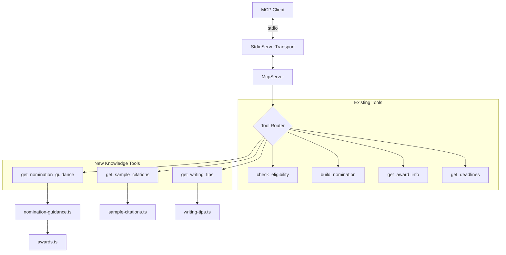

# Design Document: Nomination Form Writer Knowledge Tools

## Overview

This design adds three knowledge-provider tools to the existing Scouts Good Service Awards MCP server. These tools supply the LLM client with reference material needed to write nomination forms — the MCP server does NOT generate nomination text itself.

The three new tools:

1. **get_nomination_guidance** — returns the nomination form structure, field descriptions, section-by-section guidance, and eligibility workflow instructions
2. **get_sample_citations** — returns embedded example nominations (full 7-section examples) for a given award level
3. **get_writing_tips** — returns citation masterclass guidance on narrative cohesion, quantification, testimonial integration, and common mistakes

### Key Design Decisions

- **Knowledge provider, not generator**: The MCP server returns static reference data. The model (Claude, etc.) does the creative writing using this material plus user-provided input.
- **Static embedded data**: All sample citations, writing tips, and form guidance are TypeScript constants — no network access, no external dependencies. Consistent with the existing server's zero-dependency approach.
- **Three new modules**: Each tool gets its own data module (`nomination-guidance.ts`, `sample-citations.ts`, `writing-tips.ts`) keeping concerns separated and data maintainable.
- **Optional award filtering**: All three tools accept an optional `awardName` parameter to tailor responses to the specific award being nominated for.
- **Eligibility workflow embedded in guidance**: The nomination guidance includes instructions for the model to extract data from screenshots and call `check_eligibility` before writing — keeping the workflow knowledge in the server rather than relying on the model to know the process.

## Architecture



The new tools follow the same layered pattern as existing tools:
1. Tool handler in `src/index.ts` — thin function that calls domain logic and formats the response
2. Data module — static TypeScript constants with accessor functions
3. Shared types — extends `src/types.ts` with new interfaces

## Components and Interfaces

### Tool: `get_nomination_guidance`

**Purpose**: Returns the nomination form structure, field-by-field guidance, and eligibility workflow instructions.

**Input Schema**:
```typescript
{
  awardName: z.enum(AWARD_NAMES).optional(),
}
```

**Output**: JSON object containing:
- `sections`: Array of 7 section descriptors (title, description, tips)
- `eligibilityWorkflow`: Instructions for the model to extract data from screenshots and call `check_eligibility`
- `awardSpecificGuidance`: Tailored guidance for the requested award level (if provided)

**Handler** (in `src/index.ts`):
```typescript
server.tool(
  "get_nomination_guidance",
  "Get the nomination form structure, field guidance, and eligibility workflow instructions for writing a Good Service Award nomination",
  {
    awardName: z.enum(AWARD_NAMES).optional(),
  },
  async (params) => {
    const guidance = getNominationGuidance(params.awardName);
    return {
      content: [{ type: "text", text: JSON.stringify(guidance) }],
    };
  },
);
```

### Tool: `get_sample_citations`

**Purpose**: Returns complete example nominations for the specified award level as style reference.

**Input Schema**:
```typescript
{
  awardName: z.enum(AWARD_NAMES).optional(),
}
```

**Output**: JSON object containing:
- `samples`: Array of complete example nominations (all 7 sections populated)
- `awardLevel`: The award level the samples are for
- `note`: If no exact match exists, indicates the closest available examples

**Handler** (in `src/index.ts`):
```typescript
server.tool(
  "get_sample_citations",
  "Get complete example nominations for a given award level to use as style and tone reference when writing nominations",
  {
    awardName: z.enum(AWARD_NAMES).optional(),
  },
  async (params) => {
    const samples = getSampleCitations(params.awardName);
    return {
      content: [{ type: "text", text: JSON.stringify(samples) }],
    };
  },
);
```

### Tool: `get_writing_tips`

**Purpose**: Returns citation masterclass guidance and best practices for writing nominations.

**Input Schema**:
```typescript
{
  awardName: z.enum(AWARD_NAMES).optional(),
}
```

**Output**: JSON object containing:
- `generalTips`: Writing guidance applicable to all nominations
- `commonMistakes`: Pitfalls to avoid
- `testimonialGuidance`: How to incorporate quotes effectively
- `awardSpecificTips`: Tailored advice for the requested award level (if provided)

**Handler** (in `src/index.ts`):
```typescript
server.tool(
  "get_writing_tips",
  "Get citation masterclass guidance and best practices for writing effective Good Service Award nominations",
  {
    awardName: z.enum(AWARD_NAMES).optional(),
  },
  async (params) => {
    const tips = getWritingTips(params.awardName);
    return {
      content: [{ type: "text", text: JSON.stringify(tips) }],
    };
  },
);
```

### Data Module: `src/nomination-guidance.ts`

```typescript
import type { AwardName } from "./types.js";
import type { NominationSection, NominationGuidance, EligibilityWorkflow, AwardSpecificGuidance } from "./types.js";

export const NOMINATION_SECTIONS: NominationSection[] = [/* ... */];
export const ELIGIBILITY_WORKFLOW: EligibilityWorkflow = {/* ... */};
export const AWARD_SPECIFIC_GUIDANCE: Record<AwardName, AwardSpecificGuidance> = {/* ... */};

export function getNominationGuidance(awardName?: AwardName): NominationGuidance {
  return {
    sections: NOMINATION_SECTIONS,
    eligibilityWorkflow: ELIGIBILITY_WORKFLOW,
    awardSpecificGuidance: awardName ? AWARD_SPECIFIC_GUIDANCE[awardName] : undefined,
  };
}
```

### Data Module: `src/sample-citations.ts`

```typescript
import type { AwardName } from "./types.js";
import type { SampleNomination, SampleCitationsResponse } from "./types.js";

export const SAMPLE_NOMINATIONS: SampleNomination[] = [/* ... */];

export function getSampleCitations(awardName?: AwardName): SampleCitationsResponse {
  // Filter by award level, fall back to closest available
}
```

### Data Module: `src/writing-tips.ts`

```typescript
import type { AwardName } from "./types.js";
import type { WritingTips } from "./types.js";

export const GENERAL_TIPS: string[] = [/* ... */];
export const COMMON_MISTAKES: string[] = [/* ... */];
export const TESTIMONIAL_GUIDANCE: string[] = [/* ... */];
export const AWARD_SPECIFIC_TIPS: Record<AwardName, string[]> = {/* ... */};

export function getWritingTips(awardName?: AwardName): WritingTips {
  return {
    generalTips: GENERAL_TIPS,
    commonMistakes: COMMON_MISTAKES,
    testimonialGuidance: TESTIMONIAL_GUIDANCE,
    awardSpecificTips: awardName ? AWARD_SPECIFIC_TIPS[awardName] : undefined,
  };
}
```

## Data Models

### New Types (added to `src/types.ts`)

```typescript
// --- Nomination Guidance Types ---

export interface NominationSection {
  title: string;
  fieldName: keyof NominationInput;
  description: string;
  tips: string[];
  constraints?: string;
}

export interface EligibilityWorkflow {
  description: string;
  steps: EligibilityWorkflowStep[];
}

export interface EligibilityWorkflowStep {
  step: number;
  instruction: string;
  details?: string;
}

export interface AwardSpecificGuidance {
  awardName: AwardName;
  evidenceRequired: string;
  typicalProfile: string;
  tips: string[];
}

export interface NominationGuidance {
  sections: NominationSection[];
  eligibilityWorkflow: EligibilityWorkflow;
  awardSpecificGuidance?: AwardSpecificGuidance;
}

// --- Sample Citations Types ---

export interface SampleNomination {
  nomineeName: string;
  awardLevel: AwardName;
  mainRole: string;
  additionalService: string;
  keyAchievements: string;
  levelOfService: string;
  communityInvolvement: string;
  otherInformation: string;
  citation: string;
}

export interface SampleCitationsResponse {
  samples: SampleNomination[];
  awardLevel: AwardName | "all";
  note?: string;
}

// --- Writing Tips Types ---

export interface WritingTips {
  generalTips: string[];
  commonMistakes: string[];
  testimonialGuidance: string[];
  awardSpecificTips?: string[];
}
```

### Nomination Sections Data

The 7 sections map directly to the existing `NominationInput` fields:

| Section | Field | Constraints | Key Guidance |
|---------|-------|-------------|--------------|
| Main Role | `mainRole` | Required, non-empty | Describe the nominee's primary Scouting role and responsibilities |
| Additional Service | `additionalService` | Required, non-empty | Other roles, committees, training teams, or support beyond main role |
| Key Achievements | `keyAchievements` | Required, non-empty | Specific accomplishments with figures where possible |
| Level of Service | `levelOfService` | Required, non-empty | How service has grown or been sustained over time |
| Community Involvement | `communityInvolvement` | Required, non-empty | Impact beyond Scouting — community projects, partnerships |
| Other Information | `otherInformation` | Required, non-empty | Context that doesn't fit elsewhere — personal challenges overcome, etc. |
| Citation | `citation` | Required, max 300 chars | Read aloud at presentation — concise summary of why they deserve the award |

### Embedded Sample Data

Two Silver Wolf nominations are embedded as full 7-section examples:

1. **George Macgregor** — demonstrates long service narrative, quantified achievements, community impact
2. **Mohammad Sagir** — demonstrates diversity of contribution, progression through roles, community partnerships

### Eligibility Workflow Data

The workflow instructs the model to:
1. Ask the user for (or extract from screenshots) the nominee's service years, previous awards, date of last award, membership status, appointment status, mandatory learning, and criminal record check status
2. Call `check_eligibility` with the extracted data
3. Report the result to the user before proceeding
4. If ineligible, suggest which awards the nominee does qualify for (call `check_eligibility` without a target award)

## Correctness Properties

*A property is a characteristic or behavior that should hold true across all valid executions of a system — essentially, a formal statement about what the system should do. Properties serve as the bridge between human-readable specifications and machine-verifiable correctness guarantees.*

### Property 1: Section completeness

*For any* section returned by `getNominationGuidance()`, it SHALL have a non-empty `title`, a non-empty `description`, and a non-empty `tips` array with at least one entry.

**Validates: Requirements 1.2**

### Property 2: Award-specific guidance availability

*For any* valid `AwardName`, calling `getNominationGuidance(awardName)` SHALL return a response where `awardSpecificGuidance` is defined, has a matching `awardName` field, and contains non-empty `evidenceRequired`, `typicalProfile`, and `tips` fields.

**Validates: Requirements 1.4, 1.5**

### Property 3: Fallback samples with note

*For any* valid `AwardName` that is not `"Silver Wolf"`, calling `getSampleCitations(awardName)` SHALL return a response with at least one sample and a non-empty `note` field indicating the award level difference.

**Validates: Requirements 2.3**

### Property 4: Sample nomination completeness

*For any* sample nomination returned by `getSampleCitations()`, all 7 section fields (`mainRole`, `additionalService`, `keyAchievements`, `levelOfService`, `communityInvolvement`, `otherInformation`, `citation`) SHALL be non-empty strings.

**Validates: Requirements 2.5**

### Property 5: Award-specific writing tips availability

*For any* valid `AwardName`, calling `getWritingTips(awardName)` SHALL return a response where `awardSpecificTips` is a non-empty array of strings.

**Validates: Requirements 3.5**

## Error Handling

### Input Validation

All three new tools use the same Zod-based schema validation as existing tools:
- The `awardName` parameter is validated against the `AWARD_NAMES` enum by Zod before the handler runs
- Invalid award names produce standard MCP protocol errors automatically
- No additional domain-level validation is needed since the tools are read-only knowledge providers with no complex business rules

### Edge Cases

- **No award specified**: All three tools return general (non-award-specific) content when `awardName` is omitted. The `awardSpecificGuidance` / `awardSpecificTips` fields are `undefined` in the response.
- **Award with no samples**: When `getSampleCitations` is called for an award level without embedded examples, it returns the closest available samples (Silver Wolf) with a `note` explaining the difference. It never returns an empty samples array.
- **Response size**: Sample citations include full 7-section text which may be large. This is intentional — the model needs complete examples to match tone and depth. No truncation is applied.

### Response Format

Consistent with existing tools, all responses are returned as:
```typescript
{
  content: [{ type: "text", text: JSON.stringify(result) }],
}
```

No error objects are returned from these tools under normal operation since they are pure data lookups with no failure modes beyond invalid input (caught by Zod).

## Testing Strategy

### Unit Tests (Vitest)

Example-based tests covering:
- `getNominationGuidance()` returns exactly 7 sections
- Citation section includes 300-character constraint
- `getSampleCitations("Silver Wolf")` returns both George Macgregor and Mohammad Sagir
- `getSampleCitations()` without parameter returns all available samples
- `getWritingTips()` returns non-empty `generalTips`, `commonMistakes`, and `testimonialGuidance`
- Writing tips cover the required topics (narrative cohesion, quantification, community involvement, level of service progression, citation brevity)
- Eligibility workflow includes steps for screenshot data extraction, calling `check_eligibility`, reporting results, and fallback for ineligible nominees
- Tool names follow snake_case convention
- Tool descriptions are non-empty

### Property-Based Tests (fast-check + Vitest)

Each correctness property is implemented as a property-based test with minimum 100 iterations:

- **Property 1**: Generate a random index into the sections array, verify the section at that index has non-empty title, description, and tips
- **Property 2**: Generate a random valid `AwardName`, call `getNominationGuidance(awardName)`, verify `awardSpecificGuidance` is complete
- **Property 3**: Generate a random `AwardName` that is not `"Silver Wolf"`, call `getSampleCitations(awardName)`, verify samples returned with note
- **Property 4**: For each sample in `getSampleCitations()`, verify all 7 fields are non-empty strings
- **Property 5**: Generate a random valid `AwardName`, call `getWritingTips(awardName)`, verify `awardSpecificTips` is non-empty

**Test configuration**:
- Library: fast-check (already a devDependency)
- Runner: Vitest (already configured)
- Minimum iterations: 100 per property
- Tag format: `// Feature: nomination-form-writer, Property N: <property text>`

### Integration Tests

- Verify the MCP server lists 7 tools (4 existing + 3 new)
- Verify each new tool responds to valid input with the expected response shape
- Verify the server starts without network access or environment variables

