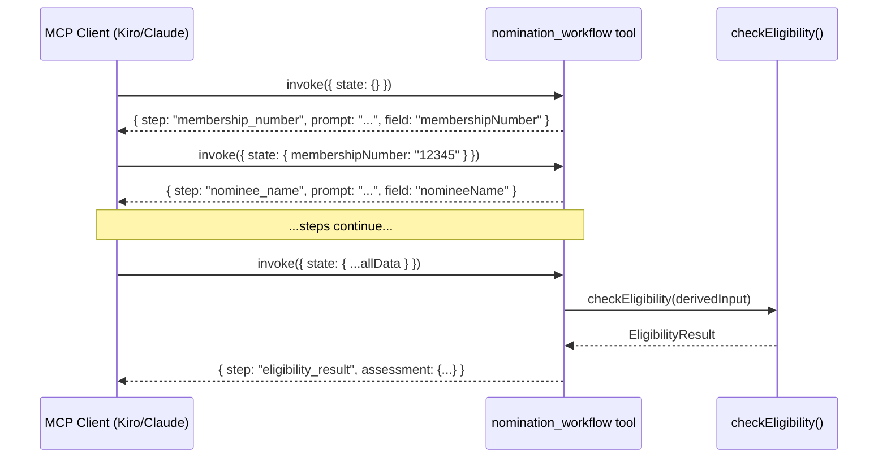

# Design Document: Nomination Workflow

## Overview

The nomination workflow tool (`nomination_workflow`) is a stateless, step-based MCP tool that guides users through collecting nominee data from the Scouts membership system. It determines the next step in the data-gathering sequence based on the current workflow state passed in on each invocation.

The tool does not replace existing tools (`check_eligibility`, `build_nomination`, etc.) — it orchestrates the conversational flow that precedes their use. Each invocation receives the complete workflow state, evaluates which data is still missing, and returns a structured response telling the MCP client what to prompt the user for next.

### Design Decisions

1. **Single tool, not multiple**: One `nomination_workflow` tool handles all steps rather than separate tools per step. This keeps the MCP tool surface small and lets the client drive the conversation with a simple loop: invoke → display prompt → collect input → invoke again.

2. **State passed in, not stored**: The tool is purely functional — given the same state, it always returns the same response. No server-side sessions. The MCP client is responsible for accumulating state between invocations.

3. **Reuses existing eligibility logic**: The eligibility assessment step delegates to the existing `checkEligibility` function rather than reimplementing the rules.

4. **Step identifiers, not step numbers**: Steps are identified by string keys (e.g. `"membership_number"`, `"current_roles"`) rather than sequential integers. This makes the logic resilient to step insertion/reordering and makes the code self-documenting.

## Architecture



The tool is registered on the existing `McpServer` instance in `index.ts` alongside the other tools. It imports and calls `checkEligibility` from `eligibility.ts` when all prerequisite data has been collected.

### Module Structure

```
src/
├── index.ts                          # Registers nomination_workflow tool
├── nomination-workflow.ts            # Core step-resolution logic
├── nomination-workflow.test.ts       # Unit tests
├── nomination-workflow.property.test.ts  # Property-based tests
└── types.ts                          # Extended with WorkflowState types
```

## Components and Interfaces

### Tool Registration (in index.ts)

The tool is registered with a single `state` parameter — a JSON object representing all data collected so far:

```typescript
server.tool(
  "nomination_workflow",
  "Guide the user step-by-step through collecting nominee data for a Good Service Award nomination",
  {
    state: z.object({
      membershipNumber: z.string().optional(),
      nomineeName: z.string().optional(),
      currentRoles: z.object({
        hasNonProvisionalRole: z.boolean(),
        totalRoles: z.number().int().nonnegative(),
      }).optional(),
      historicRoles: z.object({
        earliestStartDate: z.string(),
        totalServiceYears: z.number().int().nonnegative(),
      }).optional(),
      currentAwards: z.object({
        highestAward: z.enum([...AWARD_NAMES, "none"]),
      }).optional(),
      criminalRecordCheck: z.boolean().optional(),
      mandatoryLearning: z.boolean().optional(),
      lineManagers: z.object({
        confirmed: z.boolean(),
        input: z.array(z.object({
          name: z.string(),
          quote: z.string(),
          observation: z.string(),
          example: z.string(),
        })).optional(),
      }).optional(),
    }).default({}),
  },
  async (params) => {
    const result = resolveNextStep(params.state);
    return {
      content: [{ type: "text", text: JSON.stringify(result) }],
    };
  },
);
```

### Core Function: `resolveNextStep`

```typescript
export function resolveNextStep(state: WorkflowState): WorkflowResponse
```

This is the pure function that contains all step-resolution logic. It inspects the state and returns the appropriate response for the next step.

### Response Types

Every response from the tool follows one of two shapes:

**Step response** (prompting for data):
```typescript
interface StepResponse {
  step: StepId;
  prompt: string;
  instructions?: string;
  field: string;
  nextStep: StepId;
}
```

**Result response** (eligibility assessment or summary):
```typescript
interface ResultResponse {
  step: "eligibility_result" | "summary";
  assessment?: EligibilityAssessment;
  summary?: NominationSummary;
}
```

**Error response** (invalid state):
```typescript
interface ErrorResponse {
  error: true;
  message: string;
  invalidFields?: string[];
}
```

### Step Resolution Order

The function evaluates fields in this fixed order:

| Priority | Step ID | Field | Condition to advance |
|----------|---------|-------|---------------------|
| 1 | `membership_number` | `membershipNumber` | Non-empty string |
| 2 | `nominee_name` | `nomineeName` | 2–100 chars, non-whitespace |
| 3 | `current_roles` | `currentRoles` | Object with role data |
| 4 | `historic_roles` | `historicRoles` | Object with service data |
| 5 | `current_awards` | `currentAwards` | Object with highest award |
| 6 | `criminal_record_check` | `criminalRecordCheck` | Boolean |
| 7 | `mandatory_learning` | `mandatoryLearning` | Boolean |
| 8 | `eligibility_result` | — | Computed from state |
| 9 | `line_managers` | `lineManagers` | Only if eligible |
| 10 | `summary` | — | Final output |

## Data Models

### WorkflowState

```typescript
interface WorkflowState {
  membershipNumber?: string;
  nomineeName?: string;
  currentRoles?: {
    hasNonProvisionalRole: boolean;
    totalRoles: number;
  };
  historicRoles?: {
    earliestStartDate: string; // ISO date
    totalServiceYears: number;
  };
  currentAwards?: {
    highestAward: AwardName | "none";
  };
  criminalRecordCheck?: boolean;
  mandatoryLearning?: boolean;
  lineManagers?: {
    confirmed: boolean;
    input?: LineManagerInput[];
  };
}

interface LineManagerInput {
  name: string;
  quote: string;
  observation: string;
  example: string;
}
```

### WorkflowResponse (union type)

```typescript
type StepId =
  | "membership_number"
  | "nominee_name"
  | "current_roles"
  | "historic_roles"
  | "current_awards"
  | "criminal_record_check"
  | "mandatory_learning"
  | "eligibility_result"
  | "line_managers"
  | "line_manager_input"
  | "summary";

type WorkflowResponse = StepResponse | ResultResponse | ErrorResponse;

interface StepResponse {
  step: StepId;
  prompt: string;
  instructions?: string;
  field: string;
  nextStep: StepId;
}

interface EligibilityAssessment {
  eligible: boolean;
  hasValidAppointment: boolean;
  totalServiceYears: number;
  highestCurrentAward: AwardName | "none";
  nextAwardInProgression: AwardName | null;
  unmetCriteria?: UnmetCriterion[];
}

interface ResultResponse {
  step: "eligibility_result" | "summary";
  assessment?: EligibilityAssessment;
  summary?: NominationSummary;
}

interface NominationSectionStatus {
  section: string;
  status: "populatable" | "requires_input";
  description: string;
}

interface NominationSummary {
  sections: NominationSectionStatus[];
  availableTools: Array<{ name: string; purpose: string }>;
}

interface ErrorResponse {
  error: true;
  message: string;
  invalidFields?: string[];
}
```

### Eligibility Derivation

When all eligibility-relevant fields are present, the tool derives an `EligibilityInput` for the existing `checkEligibility` function:

```typescript
function deriveEligibilityInput(state: WorkflowState): EligibilityInput {
  return {
    serviceYears: state.historicRoles!.totalServiceYears,
    isMember: true, // Assumed — they're in the membership system
    isAppointed: state.currentRoles!.hasNonProvisionalRole,
    mandatoryLearningComplete: state.mandatoryLearning!,
    criminalRecordCheckValid: state.criminalRecordCheck!,
    previousAward: state.currentAwards!.highestAward,
  };
}
```

## Correctness Properties

*A property is a characteristic or behavior that should hold true across all valid executions of a system — essentially, a formal statement about what the system should do. Properties serve as the bridge between human-readable specifications and machine-verifiable correctness guarantees.*

### Property 1: Step resolution follows defined field order

*For any* valid workflow state, `resolveNextStep` SHALL return the step corresponding to the first missing field in the defined order: membershipNumber → nomineeName → currentRoles → historicRoles → currentAwards → criminalRecordCheck → mandatoryLearning → eligibility_result.

**Validates: Requirements 1.1, 2.1, 2.2, 3.1, 4.1, 5.1, 6.1, 7.5**

### Property 2: Step responses contain all required fields

*For any* valid workflow state that produces a step response (not a result or error response), the response SHALL contain non-empty `step`, `prompt`, `field`, and `nextStep` properties.

**Validates: Requirements 1.3, 10.6**

### Property 3: Invalid state produces error response

*For any* workflow state containing fields with invalid types or values (e.g. non-string membershipNumber, negative totalRoles, unrecognised highestAward value), `resolveNextStep` SHALL return an error response with `error: true` and a non-empty `message`, without throwing an unhandled exception.

**Validates: Requirements 1.4, 10.5**

### Property 4: Whitespace-only values do not advance the step

*For any* string composed entirely of whitespace characters provided as `membershipNumber` or `nomineeName`, `resolveNextStep` SHALL return the same step as if the field were absent (i.e. it does not advance to the next step).

**Validates: Requirements 2.4**

### Property 5: Complete eligibility state produces assessment with all required fields

*For any* workflow state where all eligibility-relevant fields are populated (currentRoles, historicRoles, currentAwards, criminalRecordCheck, mandatoryLearning), `resolveNextStep` SHALL return a response with `step: "eligibility_result"` and an `assessment` object containing `eligible` (boolean), `hasValidAppointment` (boolean), `totalServiceYears` (number), `highestCurrentAward` (string), and `nextAwardInProgression` (string or null).

**Validates: Requirements 7.1, 7.2**

### Property 6: Ineligible nominees get unmet criteria reported

*For any* complete eligibility state where the derived input would fail `checkEligibility` (e.g. insufficient service years, no valid appointment), the assessment SHALL include a non-empty `unmetCriteria` array with `eligible: false`.

**Validates: Requirements 7.3**

### Property 7: Eligible nominees get positive result with next award identified

*For any* complete eligibility state where the derived input passes `checkEligibility`, the assessment SHALL have `eligible: true` and `nextAwardInProgression` set to a valid award name.

**Validates: Requirements 7.4**

### Property 8: Unconfirmed line managers block advancement

*For any* workflow state where the nominee is eligible but `lineManagers.confirmed` is `false`, `resolveNextStep` SHALL return the `line_managers` step again (not advance to line_manager_input or summary).

**Validates: Requirements 8.2**

### Property 9: Confirmed line managers without input prompts for input

*For any* workflow state where the nominee is eligible and `lineManagers.confirmed` is `true` but `lineManagers.input` is missing or empty, `resolveNextStep` SHALL return step `"line_manager_input"`.

**Validates: Requirements 8.3**

### Property 10: Fully-populated state produces summary with correct section classification

*For any* fully-populated workflow state (eligible nominee with line manager input), `resolveNextStep` SHALL return a `summary` response where each of the 7 nomination form sections has a `status` of either `"populatable"` or `"requires_input"`, and every section with `"requires_input"` has a non-empty `description`.

**Validates: Requirements 9.1, 9.2, 9.3**

### Property 11: resolveNextStep is deterministic

*For any* valid workflow state, calling `resolveNextStep(state)` multiple times with the same input SHALL always produce the same output.

**Validates: Requirements 10.1**

## Error Handling

### Input Validation

Zod schema validation handles type-level errors at the MCP tool boundary. The `state` parameter schema rejects:
- Non-object inputs
- Fields with wrong types (e.g. `membershipNumber` as a number)
- Invalid enum values for `highestAward`
- Negative numbers for `totalRoles` or `totalServiceYears`

When Zod rejects input, the MCP SDK returns a standard error response to the client. The tool handler itself is never invoked.

### Semantic Validation in resolveNextStep

For cases that pass Zod but are semantically invalid, `resolveNextStep` performs additional checks:
- Whitespace-only strings for `membershipNumber` or `nomineeName` are treated as absent
- `nomineeName` must be between 2 and 100 characters (after trimming)

These produce a re-prompt (same step returned) rather than an error response.

### Eligibility Errors

The `checkEligibility` function may encounter edge cases (e.g. `totalServiceYears` of 0). Since the workflow collects this data from screenshots interpreted by the client, the tool trusts the values provided. If `checkEligibility` returns unexpected results, they are passed through to the client as-is.

### No Unhandled Exceptions

The `resolveNextStep` function is wrapped in a try-catch at the tool handler level. Any unexpected error is caught and returned as:

```typescript
{
  content: [{ type: "text", text: JSON.stringify({ error: true, message: "Unexpected error during workflow step resolution" }) }]
}
```

## Testing Strategy

### Unit Tests (`nomination-workflow.test.ts`)

Example-based tests covering:
- Empty state returns membership_number step
- Each step transition with minimal valid state
- Response content (prompts include expected instructions/navigation paths)
- Summary includes all three tool references
- Tool registration on the MCP server with correct name
- Error wrapping in content array format

### Property-Based Tests (`nomination-workflow.property.test.ts`)

Using `fast-check` (already a dev dependency), minimum 100 iterations per property:

- **Property 1**: Generate random partial states, verify step matches first missing field
- **Property 2**: Generate valid states, verify step responses have all required fields
- **Property 3**: Generate states with invalid field values, verify error responses
- **Property 4**: Generate whitespace strings, verify no advancement
- **Property 5**: Generate complete eligibility states, verify assessment shape
- **Property 6**: Generate states that fail eligibility, verify unmetCriteria populated
- **Property 7**: Generate states that pass eligibility, verify eligible=true with award
- **Property 8**: Generate eligible states with confirmed=false, verify no advancement
- **Property 9**: Generate eligible states with confirmed=true but no input, verify prompt
- **Property 10**: Generate fully-populated states, verify summary section classification
- **Property 11**: Generate any valid state, call twice, verify identical output

Each property test is tagged with:
```typescript
// Feature: nomination-workflow, Property N: <property text>
```

### Integration Test

A single integration test in `server.test.ts` verifying the tool is callable via the MCP server and returns the expected response format.

